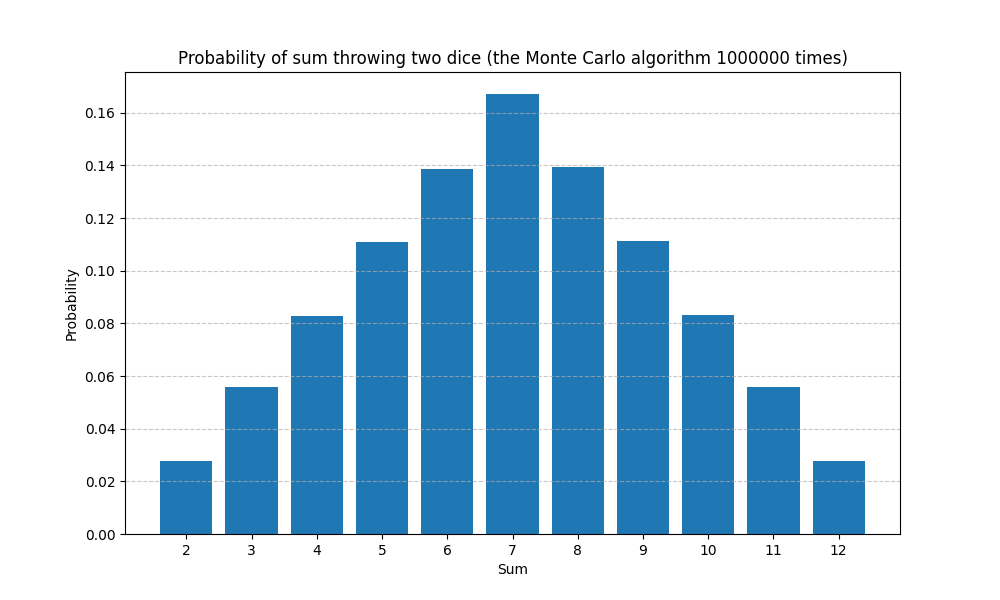

## Comparison

The obtained results can be compared with the analytically calculated probabilities for throwing two dice. This allows us to verify the correctness of the Monte Carlo algorithm implementation and its correspondence to the analytical results.

## Conclusion

The simulation results demonstrate that the obtained probabilities correspond to the analytically calculated values. This indicates the correctness of the Monte Carlo algorithm implementation for this task.

# Results and Conclusion

## Results

In this task, we implemented the Monte Carlo algorithm to simulate throwing two dice and calculate the probabilities for each possible sum.

The simulation yielded the following results for the probabilities of each sum:

| Sum | Analytical Probability | Monte Carlo Probability |
| --- | ---------------------- | ----------------------- |
| 2   | 2.78% (1/36)           | 2.77% (0.0277)          |
| 3   | 5.56% (2/36)           | 5.58% (0.0558)          |
| 4   | 8.33% (3/36)           | 8.28% (0.0828)          |
| 5   | 11.11% (4/36)          | 11.11% (0.1111)         |
| 6   | 13.89% (5/36)          | 13.84% (0.1384)         |
| 7   | 16.67% (6/36)          | 16.71% (0.1671)         |
| 8   | 13.89% (5/36)          | 13.93% (0.1393)         |
| 9   | 11.11% (4/36)          | 11.11% (0.1111)         |
| 10  | 8.33% (3/36)           | 8.31% (0.0831)          |
| 11  | 5.56% (2/36)           | 5.59% (0.0559)          |
| 12  | 2.78% (1/36)           | 2.76% (0.0276)          |

## Graphical Representation

